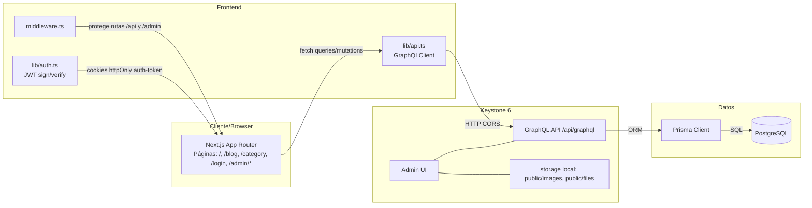

## Diagrama de Arquitectura (alto nivel)

Componentes: Next.js (App Router), Keystone 6 (GraphQL + Admin UI), Prisma, PostgreSQL, JWT, Middleware, Almacenamiento local.

### Notas técnicas
- Keystone expone GraphQL y Admin UI en `KEYSTONE_PORT` con CORS a `FRONTEND_URL`.
- Next.js consume GraphQL vía `graphql-request` con `NEXT_PUBLIC_API_URL`.
- Middleware valida cookie `auth-token` (JWT) para `/api/*` y rutas protegidas.
- Esquema de datos en `schema.prisma` y listas en `schema/*.ts`.
- Almacenamiento local puede migrarse a S3/GCS modificando `storage` en `keystone.ts`.

