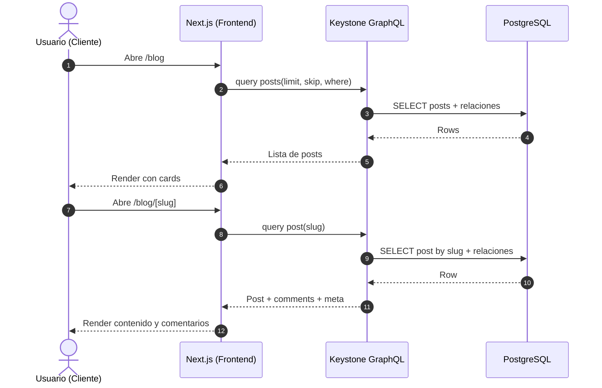
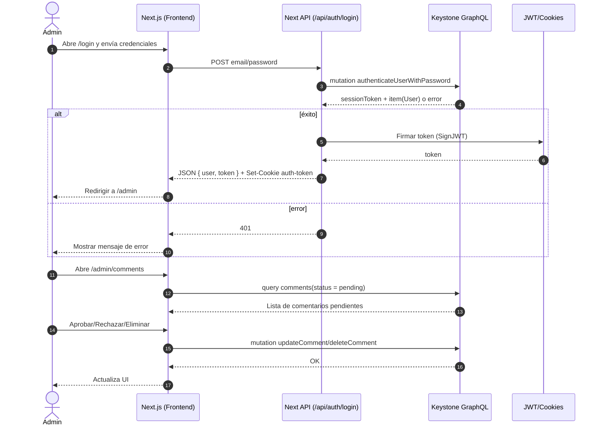
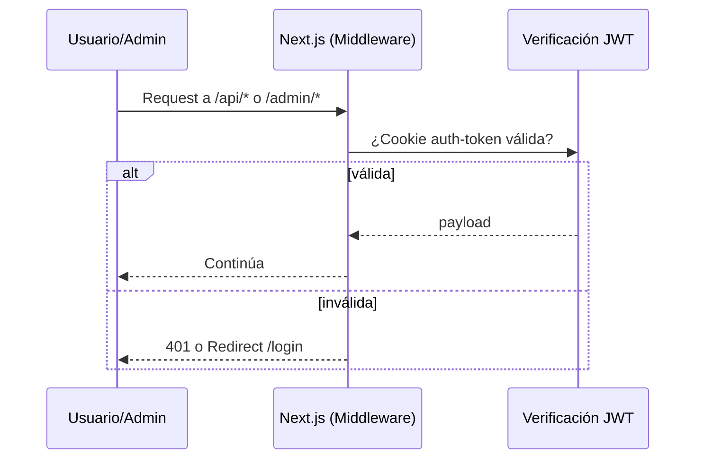

## Diagrama de Secuencia

Secuencias principales de la aplicación vistas desde cliente y backoffice admin.

### 1) Cliente: Ver listado y detalle de posts

### 2) Admin: Login y moderación de comentarios

### 3) Middleware protección

